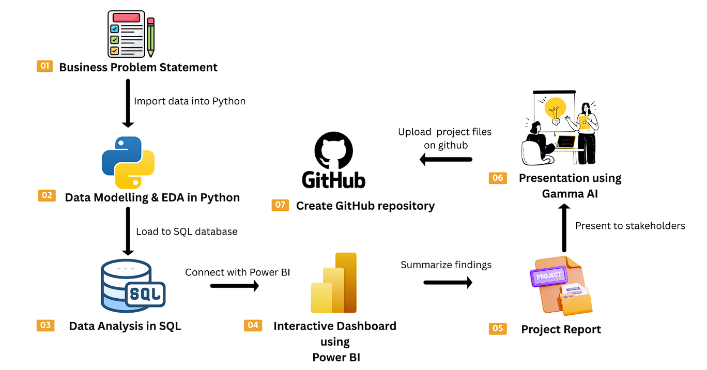
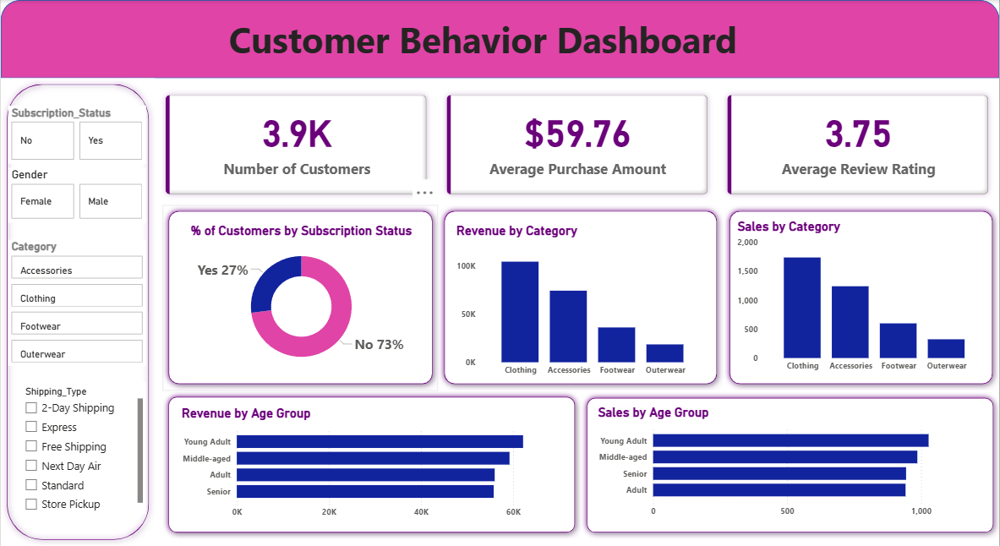

# 👨🏻‍💻 Customer Behavior Data Analytics Project

This repository contains an end-to-end **Customer Behavior Data Analytics Project**, designed to simulate a real-world, industry-standard analytics workflow.
The project demonstrates how raw customer data can be transformed into meaningful business insights using **Python, SQL, and Power BI**.

This project is suitable for:

* 📊 Data Analyst & Business Analyst portfolio
* 📚 Hands-on practice with Python, SQL, and BI tools
* 💼 Interview preparation and real-world analytics demonstration

---

## 📌 Project Objective

The primary objective of this project is to analyze customer shopping behavior and generate actionable insights related to:

* Customer segmentation
* Purchase patterns
* Loyalty indicators
* Revenue drivers

The project follows a complete analytics lifecycle from data ingestion to insight presentation.

---

## 📄 Business Problem Document

The detailed business context, objectives, and deliverables for this project are documented here:

📘 **Business Problem Statement (PDF)**
👉 [`docs/Business_Problem_Document.pdf`](docs/Business_Problem_Document.pdf)

---

## 🧩 Project Workflow

1. **Data Preparation & Cleaning (Python)**

   * Import raw customer data
   * Handle missing values and inconsistencies
   * Perform exploratory data analysis (EDA)
   * Prepare data for database storage

2. **Database & Querying (SQL)**

   * Load cleaned data into a relational database
   * Write SQL queries to answer business-driven questions
   * Analyze customer trends, spending behavior, and retention

3. **Data Visualization (Power BI)**

   * Connect SQL database to Power BI
   * Build interactive dashboards
   * Highlight KPIs, customer segments, and trends

4. **Insights & Reporting**

   * Summarize key analytical findings
   * Provide business recommendations based on data
   * Prepare structured insights suitable for stakeholders

---

### 📊 Project Workflow Diagram



---

## 📊 Dashboard Preview



---

## 📽️ Project Presentation

A concise presentation summarizing the business problem, data analysis, key insights, and strategic recommendations:

📊 **Customer Shopping Behavior Analysis (PPT)**  
👉 [`presentation/Customer_Shopping_Behavior_Analysis.pptx`](presentation/Customer_Shopping_Behavior_Analysis.pptx)

---

## 🛠️ Tools & Technologies Used

* **Python**: Pandas, NumPy, Matplotlib, Seaborn
* **SQL**: MySQL / PostgreSQL / SQL Server
* **Power BI**: Interactive dashboards & visual analytics
* **Jupyter Notebook**: Data analysis and documentation
* **Git & GitHub**: Version control and project sharing

---

## 📂 Repository Structure

```
customer-shopping-behavior-analysis-sql-python-powerbi/
│
├── data/
│ └── customer_shopping_behavior.csv
│
├── notebooks/
│ └── Customer_Shopping_Behavior_Analysis.ipynb
│
├── sql/
│ └── customer_behavior_sql_queries.sql
│
├── dashboard/
│ └── customer_behavior_dashboard.pbix
│
├── reports/
│ └── customer_behavior_analysis_report.pdf
│
├── presentation/
│ └── Customer_Shopping_Behavior_Analysis.pptx
│
├── docs/
│ └── Business_Problem_Document.pdf
│
├── images/
│ └── dashboard.png
│
├── Project_Workflow.png
│
└── README.md
```

---

## ▶️ How to Run the Project

### 1️⃣ Clone the Repository

```bash
git clone <your-repository-url>
cd customer-shopping-behavior-analysis
```

### 2️⃣ Run Python Analysis

* Open `Customer_Shopping_Behavior_Analysis.ipynb`
* Execute all cells to clean and prepare data
* Load processed data into SQL database

### 3️⃣ Execute SQL Queries

* Open `customer_behavior_sql_queries.sql`
* Run queries to answer business questions

### 4️⃣ Open Power BI Dashboard

* Open `customer_behavior_dashboard.pbix`
* Refresh data connection
* Explore interactive visualizations

---

## 📊 Key Business Questions Answered

* Which customer segments contribute the most revenue?
* What factors influence repeat purchases?
* How does spending behavior vary by demographics?
* Which customers show high loyalty potential?
* What trends can help improve retention and sales?

---

<h2><a class="anchor" id="author--contact"></a>Author & Contact</h2>

**Suraj Lashkare**
Aspiring Data Analyst
🔗 [LinkedIn](https://www.linkedin.com/in/suraj-lashkare-2605a52aa/)
 
---
